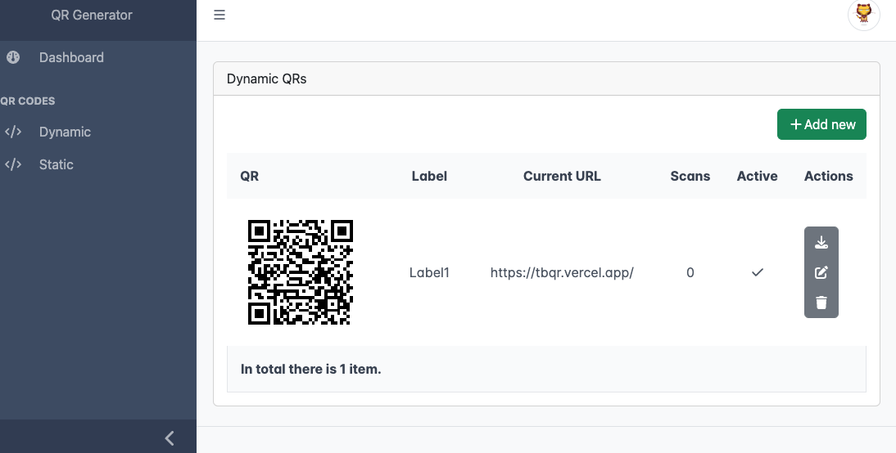

## QRForge

This program is able to create `static` and `dyanmic` QR codes, it's possible to host it yourself, or feel free to use the instance below.

## Screenshot

https://tbqr.vercel.app/

Login Page:

Dynamic QR management:

## What's working
* Integration to Github Auth
* Static QRs - create/delete
* Dyanmic QR - create/delete
* Scan counter and basic stats
* Download QRs as PNG

## What's on the roadmap
* Edit QRs
* Improve error handling
* QR options / branding
* advanced analytics
